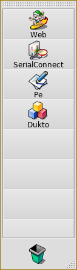

## 8Dock v. 0.9.5
Original Author: Jón Ragnarsson  
Other original contributors: Michael Pfeiffer

8Dock is a desktop dock.   
Drag files and applications into 8Dock and double-click to launch them.   
Right-click to switch between big and small icons.

<ins>History:</ins>
* 0.9.5 (2002.05.23) Fixed these bugs:
	- Trash icon context menu disappeared after opening.
	- ListItems were too large.
	- Set background color of TracerMenu text to transparent color.
	- Disabled scrolling with pressed shift key because this is buggy.
* 0.9.4 (2002.05.22) Compiled for BeOS R5 and fixed crashing bug when placing items in list.
* 0.9.3 (1999.03.21) First decent version! (Big/small icons, full preference save)
* 0.9.1 (1999.02.18) Menu bug fix
* 0.9 (1999.02.14) First R4 version, gazzilions of bugfixes, new preference system.
* 0.81 and older: R3 version, not supported anymore

